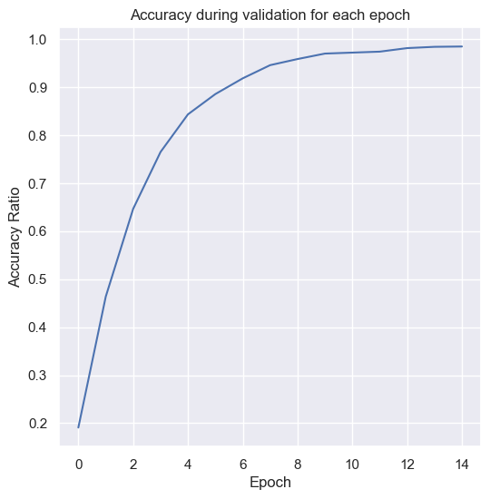
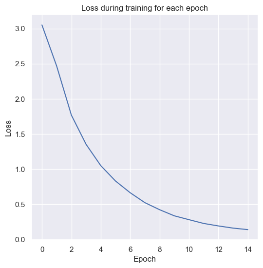
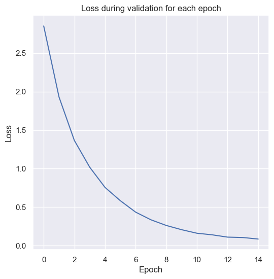

# 🎵 AudioCompass

An *ML-powered audio analyzer* with *98%* accuracy that helps you understand audio at a glance.

---

## 📋 Objective

To develop a machine learning–powered audio analyzer that can accurately:

- 🎼 Detect the *musical key & scale* (e.g., C Major, A♯ Minor)
- 🎵 Estimate the *tempo (BPM)* of a track

…all from a single audio file using a *shared feature learning model, deployed as an interactive **Streamlit application*.

---

## 🧩 Problem Formulation

- *Input:*  
  An audio file (e.g., .wav, .mp3)

- *Output:*
  - *Key:* One of 12 tonal keys (C, C#, D, …, B)
  - *Scale:* Major / Minor
  - *BPM:* A continuous numerical value (regression)

---

## 🚀 Features

✅ Accepts .wav or .mp3 audio input  
✅ Predicts:
  1. 🎼 Musical *key & scale*
  2. 🎵 *Tempo (BPM)*

---

## 📊 Results & Visualizations

Here are some example results from the model evaluation and testing:

### 🔷 Graph 1


### 🔷 Graph 2


### 🔷 Graph 3


### 🔷 Graph 4


---

## 📂 How to Run Locally

### 1️⃣ Clone the repository and navigate to the project directory

```bash
git clone https://github.com/RahulAnand2077/AudioCompass.git
cd AudioCompass
```

### 2️⃣ Install dependencies

```bash
pip install -r requirements.txt
cd stream
```

### 3️⃣ Run the Streamlit app

```bash
streamlit run app.py
```

### 4️⃣ Run the FastAPI backend server

```bash
uvicorn stream.server:app --reload --port 8000
```

### 5️⃣ Upload an audio file and view predictions.

---

## 🛠 Technologies Used
*PyTorch🔥*

*Streamlit 📈*

*Librosa 🎧*

*Scikit-learn 🔬*

*FastAPI 🍃*

*Numpy 🔢*

---

## ✨ Contributors

- *Rahul Anand*
  - GitHub: [https://github.com/RahulAnand2077](https://github.com/RahulAnand2077)
  - Email: [rahulcollege27@gmail.com](mailto:rahulcollege27@gmail.com)

- *Mayan Sequeira*
  - GitHub: [https://github.com/mayan05](https://github.com/mayan05)
  - Email: [mayan.sequeira@gmail.com](mailto:mayan.sequeira@gmail.com)
